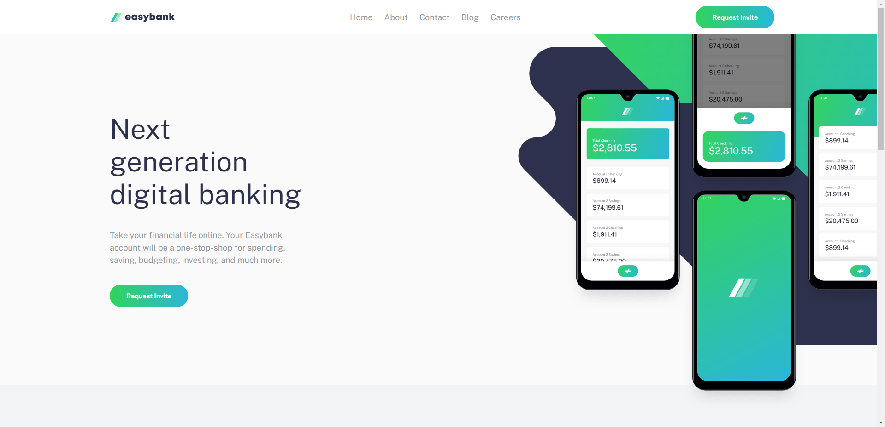

# Frontend Mentor - Easybank landing page solution

This is a solution to the [Easybank landing page challenge on Frontend Mentor](https://www.frontendmentor.io/challenges/easybank-landing-page-WaUhkoDN). Frontend Mentor challenges help you improve your coding skills by building realistic projects. 

## Table of contents

- [Overview](#overview)
  - [The challenge](#the-challenge)
  - [Screenshot](#screenshot)
  - [Links](#links)
- [My process](#my-process)
  - [Built with](#built-with)
  - [What I learned](#what-i-learned)
  - [Continued development](#continued-development)
  - [Useful resources](#useful-resources)
- [Author](#author)

## Overview

### The challenge

Users should be able to:

- View the optimal layout for the site depending on their device's screen size
- See hover states for all interactive elements on the page

### Screenshot



### Links

- Solution URL: [https://www.frontendmentor.io/solutions/easybank-landing-page-made-with-html-css-and-javascript-q42Tly9NWR](https://www.frontendmentor.io/solutions/easybank-landing-page-made-with-html-css-and-javascript-q42Tly9NWR)
- Live Site URL: [https://liquidwater0.github.io/Easybank-Landing-Page/](https://liquidwater0.github.io/Easybank-Landing-Page/)

## My process

### Built with

- Semantic HTML5 markup
- CSS custom properties
- Flexbox
- CSS Grid

### What I learned

I learned how to get images to get images to scale properly and not stretch.

```css
.article-card img {
    object-fit: cover;
    width: 100%;
    height: 250px;
    aspect-ratio: 1 / 1;
}
```

### Continued development

I would like to focus on learning more about CSS in the future.

### Useful resources

- [w3Schools](https://www.w3schools.com/) - This site helped me when I was unsure the syntax for a specific thing.

## Author

- Frontend Mentor - [@liquidwater0](https://www.frontendmentor.io/profile/liquidwater0)
